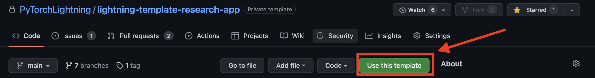
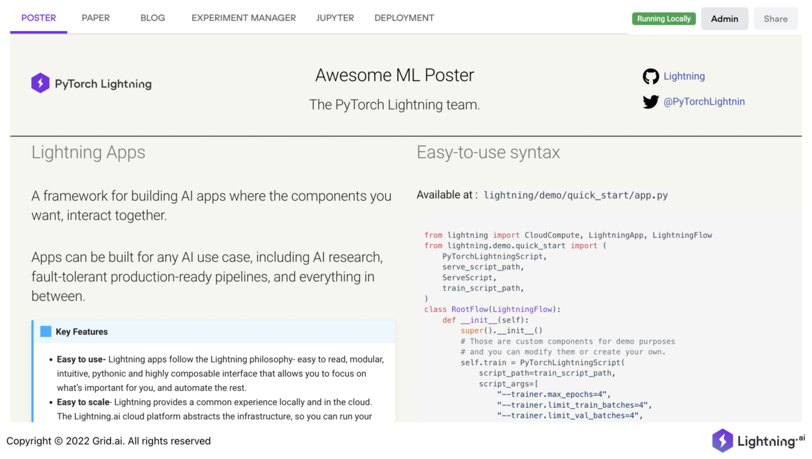

# ⚡️ Lightning Research Poster Template 🔬

Use this app to share your research paper results. This app lets you connect a blogpost, arxiv paper, and a jupyter
notebook and even have an interactive demo for people to play with the model. This app also allows industry
practitioners to reproduce your work.

## Getting started

To create a Research Poster you can install this app via the [Lightning CLI](https://lightning.ai/lightning-docs/) or
[use the template](https://docs.github.com/en/articles/creating-a-repository-from-a-template) from GitHub and
manually install the app as mentioned below.

### Installation

#### With Lightning CLI

`lightning install app lightning/research_poster`

#### Use GitHub template

Click on `Use this template` button at the top, name your app repo and GitHub will create a fork of this app your
account.



You can clone the forked app repo and follow the steps below to install the app.

```
git clone https://github.com/YOUR-USERNAME/lightning-template-research-app.git
cd lightning-template-research-app
pip install -r requirements.txt
pip install -e .
```

Once you have installed the app, you can goto the `lightning-template-research-app` folder and
run `lightning run app app.py --cloud` from terminal.
This will launch the template app in your default browser with tabs containing research paper, blog, Training
logs, and Model Demo.
You can modify the content of this app to customize to your research.

At the root of this template you will find [app.py](./app.py) that contains `ResearchApp` class, this class provides
arguments like link to paper, blog, and whether to launch a Gradio demo. You can read more about what each of the
arguments do in the docstrings.

#### Highlights

- Provide the link for paper, blog or training log manager like WandB as argument and `ResearchApp` will
  create a tab for each of these.
- Make a poster for your research by editing the markdown file in the [resources](./resources/poster.md) folder.
- Add interactive model demo with Gradio app, update the gradio component present in
  the [research_app](./research_app/components/model_demo.py) folder.
- View a Jupyter Notebook or launch fully fledged notebook instance. (Sharing a Jupyter Notebook instance can expose the
  cloud instance to security vulnerability.)
- Reorder the tab layout using `tab_order` argument.

```python
# update app.py at the root of the repo
import lightning as L

paper = "https://arxiv.org/pdf/2103.00020.pdf"
blog = "https://openai.com/blog/clip/"
github = "https://github.com/mlfoundations/open_clip"
wandb = "https://wandb.ai/aniketmaurya/herbarium-2022/runs/2dvwrme5"
tabs = ["Poster", "Blog", "Paper", "Notebook", "Training Logs", "Model Demo"]

app = L.LightningApp(
    ResearchApp(
        poster_dir="resources",
        paper=paper,
        blog=blog,
        training_log_url=wandb,
        github=github,
        notebook_path="resources/Interacting_with_CLIP.ipynb",
        launch_jupyter_lab=True,
        launch_gradio=True,
        tab_order=tabs,
    )
)
```

To run this app, launch the terminal and run `lightning run app app.py --cloud`

You should see something like this in your browser:


