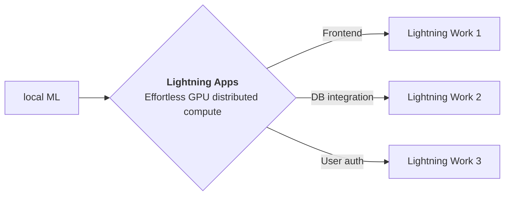

<div style="height: 90pt;"></div>
<div style="flex: 0 0 16%; margin-top: -10pt;">

</div>
<div style="flex: 0 0 65%; text-align: center;">
<h1 style="margin-bottom: 10pt;">CLIP Research Poster</h1>
<h2>The Lightning Team.</h2>
</div>
<div style="flex: 1">
    <div style="display: flex; align-items: center;">
        
        <div style="font-size: 0.9rem; margin-right: 5pt;"><a href="https://github.com/PyTorchLightning/pytorch-lightning">Lightning</a></div>
    </div>
    <div style="display: flex; align-items: center;">
        
        <div style="font-size: 0.9rem;"><a href="https://twitter.com/PyTorchLightnin">@PyTorchLightnin</a></div>
    </div>
</div>

--split--

# CLIP: Connecting Text and Images

## Paper, Blog, Experiment Manager and CLIP model demo at a single place.

Thanks to [Vivien](https://github.com/vivien000) for amazing his
work [Minimal user-friendly demo of OpenAI's CLIP for semantic image search](https://github.com/vivien000/clip-demo).

### Lightning Apps can be built for any AI use case, including AI research, fault-tolerant production-ready pipelines, and everything in between.

!!! abstract "Key Features"

```
- **Easy to use-** Lightning apps follow the Lightning philosophy- easy to read, modular, intuitive, pythonic and highly composable interface that allows you to focus on what's important for you, and automate the rest.
- **Easy to scale**- Lightning provides a common experience locally and in the cloud. The Lightning.ai cloud platform abstracts the infrastructure, so you can run your apps at any scale. The modular and composable framework allows for simpler testing and debugging.
- **Leverage the power of the community-** Lightning.ai offers a variety of apps for any use case you can use as is or build upon. By following the best MLOps practices provided through the apps and documentation you can deploy state-of-the-art ML applications in days, not months.
```



--split--

# Easy-to-use syntax

### Available at : `PyTorchLightning/lightning-template-research-app/app.py`

```python
from lightning import LightningApp
from research_app import ResearchApp

paper = "https://arxiv.org/pdf/2103.00020.pdf"
blog = "https://openai.com/blog/clip/"
github = "https://github.com/mlfoundations/open_clip"
wandb = "https://wandb.ai/aniketmaurya/herbarium-2022/runs/2dvwrme5"

app = LightningApp(
    ResearchApp(
        paper=paper,
        blog=blog,
        experiment_manager=wandb,
        enable_jupyter=True,
        enable_gradio=True,
    )
)
```

### Citation

```
@article{YourName,
  title={Your Title},
  author={Your team},
  journal={Location},
  year={Year}
}
```
