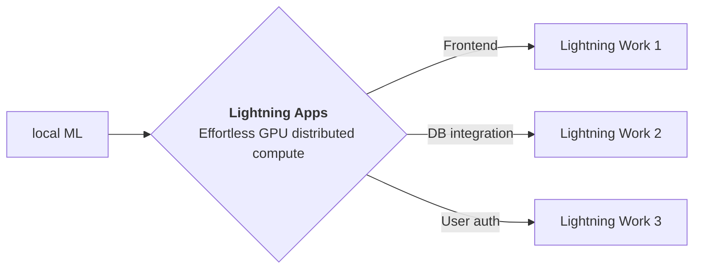

<div style="height: 90pt;"></div>
<div style="flex: 0 0 16%; margin-top: -10pt;">

</div>
<div style="flex: 0 0 65%; text-align: center;">
<h1 style="margin-bottom: 10pt;">Awesome ML Poster</h1>
<h2>The PyTorch Lightning team.</h2>
</div>
<div style="flex: 1">
    <div style="display: flex; align-items: center;">
        
        <div style="font-size: 0.9rem; margin-right: 5pt;"><a href="https://github.com/PyTorchLightning/pytorch-lightning">Lightning</a></div>
    </div>
    <div style="display: flex; align-items: center;">
        
        <div style="font-size: 0.9rem;"><a href="https://twitter.com/PyTorchLightnin">@PyTorchLightnin</a></div>
    </div>
</div>

--split--

# Lightning Apps

## A framework for building AI apps where the components you want, interact together.

## Apps can be built for any AI use case, including AI research, fault-tolerant production-ready pipelines, and everything in between.

!!! abstract "Key Features"

    - **Easy to use-** Lightning apps follow the Lightning philosophy- easy to read, modular, intuitive, pythonic and highly composable interface that allows you to focus on what's important for you, and automate the rest.
    - **Easy to scale**- Lightning provides a common experience locally and in the cloud. The Lightning.ai cloud platform abstracts the infrastructure, so you can run your apps at any scale. The modular and composable framework allows for simpler testing and debugging.
    - **Leverage the power of the community-** Lightning.ai offers a variety of apps for any use case you can use as is or build upon. By following the best MLOps practices provided through the apps and documentation you can deploy state-of-the-art ML applications in days, not months.




--split--

# Easy-to-use syntax

### Available at : `lightning/demo/quick_start/app.py`

```python

from lightning import CloudCompute, LightningApp, LightningFlow
from lightning.demo.quick_start import (
    PyTorchLightningScript,
    serve_script_path,
    ServeScript,
    train_script_path,
)


class RootFlow(LightningFlow):
    def __init__(self):
        super().__init__()
        # Those are custom components for demo purposes
        # and you can modify them or create your own.
        self.train = PyTorchLightningScript(
            script_path=train_script_path,
            script_args=[
                "--trainer.max_epochs=4",
                "--trainer.limit_train_batches=4",
                "--trainer.limit_val_batches=4",
                "--trainer.callbacks=ModelCheckpoint",
                "--trainer.callbacks.monitor=val_acc",
            ],
            cloud_compute=CloudCompute("cpu", 1),
        )
        self.serve = ServeScript(
            script_path=serve_script_path,
            exposed_ports={"serving": 8888},
            cloud_compute=CloudCompute("cpu", 1),
        )

    def run(self):
        # 1. Run the ``train_script_path`` that trains a PyTorch model.
        self.train.run()
        # 2. Will be True when a checkpoint is created by the ``train_script_path``
        # and added to the train work state.
        if self.train.best_model_path is not None:
            # 3. Serve the model until killed.
            self.serve.run(self.train.best_model_path)
            self._exit("Hello World End")

    def configure_layout(self):
        return [
            {"name": "Endpoint", "content": self.serve.exposed_url("serving") + "/docs"}
        ]


app = LightningApp(RootFlow())

```

### Citation

```bibtex

@article{YourName,
  title={Your Title},
  author={Your team},
  journal={Location},
  year={Year}
}

```
