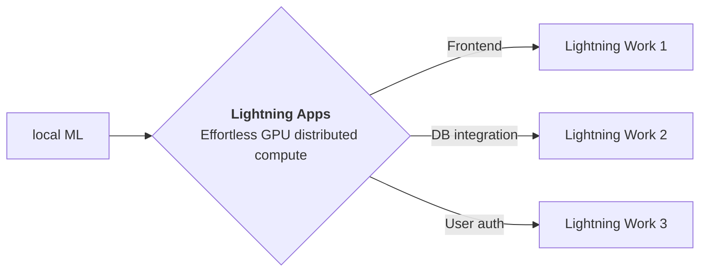

<div style="height: 90pt;"></div>
<div style="flex: 0 0 16%; margin-top: -10pt;">

</div>
<div style="flex: 0 0 65%; text-align: center;">
<h1 style="margin-bottom: 10pt;">Demo: CLIP Research Poster</h1>
<h2>A demo of CLIP research paper using Lightning App</h2>
</div>
<div style="flex: 1">
    <div style="display: flex; align-items: center;">
        
        <div style="font-size: 0.9rem; margin-right: 5pt;"><a href="https://github.com/openai/">OpenAI</a></div>
    </div>
    <div style="display: flex; align-items: center;">
        
        <div style="font-size: 0.9rem;"><a href="https://twitter.com/OpenAI">@OpenAI</a></div>
    </div>
</div>

--split--

# Natural Language based Image Search

## OpenAI introduced a neural network called CLIP which efficiently learns visual concepts from natural language supervision.

This app is a demo
of [Lightning Research Template app](https://github.com/Lightning-AI/lightning-template-research-app) which allows
authors to build an app to share their everything
related to their work at a single place.
Explore the tabs at the top of this app to view blog, paper, training logs and model demo.

You can fork this app and edit to customize according to your need.

Kudos to Soumik Rakshit and Manan Goel for their awesome
repository [clip-lightning](https://github.com/soumik12345/clip-lightning)

Thanks to [Vivien](https://github.com/vivien000) for his inspiring application using
CLIP [Minimal user-friendly demo of OpenAI's CLIP for semantic image search](https://github.com/vivien000/clip-demo).


CLIP pre-trains an image encoder and a text encoder to predict which images were paired with which texts in our dataset.
We then use this behavior to turn CLIP into a zero-shot classifier. We convert all of a dataset's classes into captions
such as "a photo of a dog" and predict the class of the caption CLIP estimates best pairs with a given image.

--split--

# Lightning Apps

## Lightning Apps can be built for any AI use case, including AI research, fault-tolerant production-ready pipelines, and everything in between.

!!! abstract "Key Features"

    - **Easy to use-** Lightning apps follow the Lightning philosophy- easy to read, modular, intuitive, pythonic and highly composable interface that allows you to focus on what's important for you, and automate the rest.
    - **Easy to scale**- Lightning provides a common experience locally and in the cloud. The Lightning.ai cloud platform abstracts the infrastructure, so you can run your apps at any scale. The modular and composable framework allows for simpler testing and debugging.
    - **Leverage the power of the community-** Lightning.ai offers a variety of apps for any use case you can use as is or build upon. By following the best MLOps practices provided through the apps and documentation you can deploy state-of-the-art ML applications in days, not months.



### Available at : `Lightning-AI/lightning-template-research-app/app.py`

```python
import lightning as L

paper = "https://arxiv.org/pdf/2103.00020.pdf"
blog = "https://openai.com/blog/clip/"
github = "https://github.com/soumik12345/clip-lightning/tree/AddModelCheckpoint"
wandb = "https://wandb.ai/manan-goel/clip-lightning-image_retrieval/runs/1cedtohj"

app = L.LightningApp(
    ResearchApp(
        resource_path="resources",
        paper=paper,
        blog=blog,
        training_log_url=wandb,
        github=github,
        notebook_path="resources/Interacting_with_CLIP.ipynb",
        launch_gradio=True,
    )
)
```

### Citation

```bibtex

@article{YourName,
  title={Your Title},
  author={Your team},
  journal={Location},
  year={Year}
}

```
